# InfoBatch 논문 리뷰

## 요약
- 새로운 Dynamic pruning 방법을 제안하며, Image Classification, Semantic Segmentation, Image Generation, LLM fine-tuning 등 다양한 작업에서 성능을 유지하면서도 연산량을 크게 줄였습니다. 
- loss 값을 score로 활용하며 임계치보다 작은 값을 모두 pruning 하는 것이 아닌, 랜덤 샘플링을 통해 일부만 pruning하여 bias를 줄이는 방법을 제안하였습니다. 

# 1. Introduction

딥러닝과 컴퓨터 비전 분야에서 학습에 사용되는 데이터의 양이 커짐에 따라 학습 비용이 많이 들게 되었습니다. 이러한 문제를 해결하기 위해 Distillation, Coreset Selection, Weight Sampling Method 등이 제안되었으나, 이들 방법은 기존 모델과 성능 차이가 크거나 학습 시간이 많이 소요되는 문제점이 있습니다. 최근에는 총 학습 반복 횟수(Total Training Iteration)를 줄이는 방법들이 제안되었습니다. 샘플의 점수를 추정하고, 그에 따라 정보량이 적은 샘플을 가지치기(Pruning)하는 방법이 제안되었습니다.

Pruning에는 두 가지 방법이 있습니다. 먼저, 정보량이 적은 샘플을 학습 과정에서 제외하는 **Static pruning**은 제대로된 score를 찾기 위해 데이터셋 전체에 대한 사전 작업이 필요하기 때문에 trial 연산이 높다는 단점이 있습니다. 이를 해결하기 위해 등장한 방법 **Dynamic pruning**이 제안되었습니다. Dynamic pruning은 정보량이 적은 샘플을 학습 과정에서 유동적으로 제외하는 방식으로, 연산량을 줄이기 위해 학습 과정에서 얻을 수 있는 loss를 활용하여 샘플을 선택합니다. 

그러나 Static pruning보다 개선하였지만, 초기 Dynamic pruning은 pruning 주기 동안 전체 데이터셋을 score 순으로 정렬하며 연산량이 늘어나는 문제점이 있습니다. 또한, 데이터를 직접 pruning하며 아래 그림과 같이 gradient bias가 발생하여 성능이 불안정하다는 문제점이 있습니다.

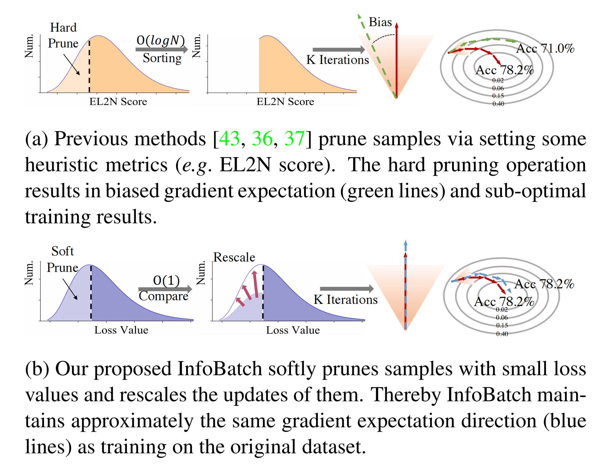

**InfoBatch**는 dynamic pruning을 활용한 방법입니다. pruning된 데이터셋과 원본 데이터셋 간의 same expected total update를 유지하는 아이디어를 기반으로 한 bias가 없는 dynamic pruning입니다. 각 epoch마다 low score(잘 학습된) 샘플의 일부를 무작위로 pruning합니다. 기존 방법론(그림(a))처럼 low score 샘플을 바로 버리지 않고, InfoBatch는 low score 샘플의 일부를 그림(b)처럼 gradient를 확대하여 원래 데이터셋과 거의 동일한 gradient expectation을 유지하는 방법을 통해 bias를 줄입니다. 또한, InfoBatch는 성능 안정성과 수렴중 분산을 줄이기 위해 마지막 몇 epoch에서는 전체 데이터셋을 사용합니다.

InfoBatch는 다양한 딥러닝 작업에서 그 효과를 증명하였습니다. Classification, Semantic Segmentation, Vision pretaining, language model instruction finetuning 등 다양한 작업에서 InfoBatch는 기존 방법론보다 더 나은 성능을 보여주었습니다. 또한, 20%~40%의 연산량을 줄이면서도 성능을 유지하였습니다.

# 2. Method
## 2-1. Static & Dynamic Pruning

원본 데이터셋인 $\mathcal{D} = \{z_i = (x_i, y_i)\}_{i=1}^{\vert \mathcal{D} \vert}$에 대해 각 샘플의 score은 $\mathcal{H(z)}$로 정의됩니다. Static pruning은 pruning 확률 $\mathcal{P}$에 따라 임계치보다 작은 샘플 $S$을 학습에서 제외합니다. 

Dynamic pruning은 학습 과정에서 pruning이 이루어집니다. Pruning을 통해 만들어진 샘플 $S_t$의 score $\mathcal{H_t}$는 학습 과정에서 바꿀 수 있으며, 그에 따라 graident bias를 줄일 수 있습니다.

그럼에도 prunging 할때 마다 low score 샘플이 지속적으로 겹쳐 bias가 생기거나, pruning으로 인해 gradient update의 수가 줄고, scoring과 pruning을 위한 연산량이 늘어나는 문제점이 있습니다.

## 2-2. Overview

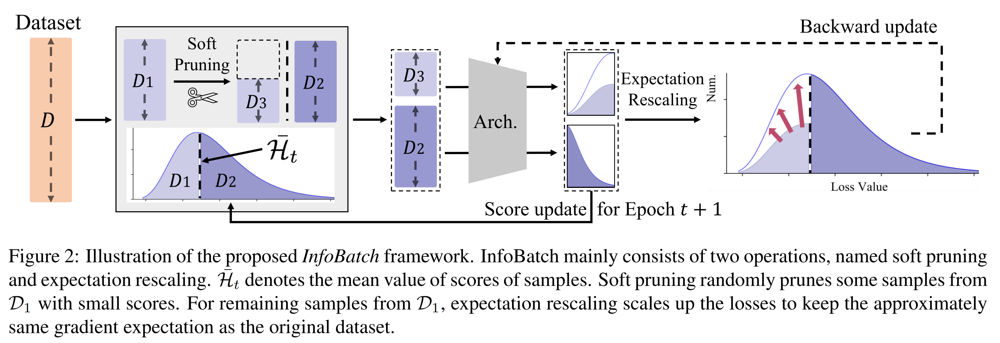

그림과 같이 각 샘플에 대해 forward propagation으로 얻은 loss값을 socre로 활용하기 때문에 추가 연산 및 정렬과정 없이 pruning이 가능합니다. 임계치는 score들의 평균이 pruning의 임계치가 됩니다. 그 다음 각 epoch에서 원본 데이터셋과 동일한 gradient expectation을 유지하기 위해 남은 low score 샘플들의 gradient를 확대합니다. 마지막으로 몇 epoch에서는 학습에 전체 데이터셋을 활용하여 성능 변동성을 줄이고, bias를 줄이며 원본 데이터셋과의 성능 차이를 줄입니다.

## 2-3. Unbiased Prune and Rescale
InfoBatch는 Pruning 과정에서 무작위성을 도입했습니다. 주어진 데이터셋 $\mathcal{D}$에서 $t$번째 epoch에서 각 샘플의 score에 따라 pruning 확률이 할당됩니다. 

$$\mathcal{P}_t(z) = \begin{cases} r,&\mathcal{H}_t(z) < \bar{\mathcal{H}}_t \newline 0,&\mathcal{H}_t(z) \ge \bar{\mathcal{H}}_t \end{cases} \tag{3}$$

임계치보다 score가 큰 샘플은 다음 epoch의 학습에 사용되고, 임계치보다 score가 작은 샘플은 $100(1-r)$%의 확률로 사용됩니다. 이와 같은 pruning을 통해 low score 샘플을 학습에 활용하여, 이전 방법론과 달리 bias를 줄일 수 있습니다. 또한, 전체 학습 샘플을 정렬할 필요 없이 임계치와 비교하기 때문에 시간 복잡도를 $O(log N)$에서 $O(1)$로 줄일 수 있습니다.

샘플 score인 $\mathcal{H_t}$는 매 epoch마다 업데이트 되는데, 이 때 $t$번째 epoch에서 학습에 사용되지 않은 pruning된 샘플은 score를 업데이트 하지 않고, 학습에 사용된 샘플들 $S_t$은 $t$번째 계산된 loss로 score를 업데이트합니다. 

$$\mathcal{H}_{t+1}(z) = \begin{cases} \mathcal{H}_t(z),&z \in \mathcal{D} \backslash\mathcal{S}_t \newline \mathcal{L}(z),&z \in \mathcal{S}_t \end{cases} \tag{4} $$

첫번째 epoch에서는 score를 1로 초기화하고, 이후 학습에 사용된 샘플들의 score를 업데이트합니다.

Soft pruning은 gradient update 수 감소 문제를 해결하기 위해, 남은 샘플들의 gradient를 확장합니다. pruning된 샘플 $\mathcal{H}_t(z) < \bar{\mathcal{H}}_t $인 샘플의 경우, pruning 확률이 $r$이기 때문에 해당 샘플의 gradient를 $1/1-r$배로 확장합니다. score가 $\bar{\mathcal{H}}_t$보다 큰 샘플은 loss를 업데이트 하지 않습니다. 이를 통해 gradient update expectation를 원본 데이터셋과 유사하게 유지합니다. 

### Theoretical Analysis
1. **Training Objective**

    딥러닝 모델은 학습하고자 하는 loss function $L$을 갖고 있습니다. 데이터셋 $\mathcal{D}$의 모든 샘플 $z$가 연속 분포 $\rho(z)$에서 추출되었다고 가정하면 학습 목표는 아래와 같이 공식화할 수 있습니다. 

2. **Pruning and Rescaling**

    제안된 pruning을 적용한 후, 샘플 $z$는 정규화된 분포 $(1-\mathcal{P_t(z)})\rho(z)$에 따라 추출됩니다. 역전파에서 loss를 rescaling하는 것은 gradient를 rescaling하는 것과 동일합니다. 각 샘플 $z$의 loss은 $\gamma_t(z)$로 rescale하면, pruning된 데이터셋 $\mathcal{S}_t$의 loss는 아래와 같이 정의됩니다.

    $$ \arg\min_{\theta \in \Theta} E_{z \in S_t}[\gamma_t(z)L(z, \theta)] = \arg\min_{\theta \in \Theta} \frac{\int_z (1-P_t(z))\gamma_t(z)L(z, \theta)\rho(z) \, dz}{\int_z (1-P_t(z))\rho(z) \, dz} \tag{6} $$

3. Setting $\gamma_t(z)$

    $\gamma_t(z) = \frac{1}{1-P_t(z)}$로 할당하여, 수식 6을 아래와 같이 정리할 수 있습니다.

    $$ \begin{aligned} \underset{\theta \in \Theta}{\arg \min} = \frac{1}{c_t}\int_z \mathcal{L}(z, \theta)\rho(z)dz \end{aligned} \tag{7}$$

4. Equivalent Training Objective

    rescale된 인자 $\gamma_t(z)$를 사용하여 pruning된 데이터셋 $\mathcal{S_t}$에서 학습하면 원래 데이터셋을 학습하는 것과 유사한 결과를 얻을 수 있습니다. 

5. Discrete Dataset Analysis

    scale factor $1/c_t$는 아래와 같이 정의됩니다. 
    $$ \mathbb{E}\left[\frac{1}{c_t}\right] = \frac{|D|}{\sum_{z \in D}(1 - P_t(z))} \approx \frac{|D|}{|S_t|} \tag{8}$$
    $|D|$는 원본 데이터셋의 전체 개수이며, $|S_t|$는 pruning된 데이터셋의 개수입니다. Gradient가 샘플 pruning에 의해 감소된 만큼 보상된다고 볼 수 있습니다.  

    $$ \mathbb{E}[\nabla_{\theta}L(S_t)] \approx \frac{|D|}{|S_t|} \mathbb{E}[\nabla_{\theta}L(D)] \tag{9}$$

## 2.4 Annealing
학습 과정에서 초반에 pruning된 샘플의 경우, 이후 학습 과정에서 랜덤하게 추출될 수 있지만 후반에 pruning된 샘플은 이후 학습 과정에서 다시 추출될 확률이 낮아지며, gradient bias가 발생할 수 있습니다. 따라서, 주어진 epoch $C$를 기준으로 하이퍼파라미터 $\delta$를 정의하였습니다. pruning은 처음 $\delta \cdot C$ epoch동안 이뤄지며, 그 이후는 전체 데이터셋을 사용하여 학습합니다. 학습 epoch이 $\delta \cdot C$ 보다 작고, score가 임계치보다 작으면 pruning하고, epoch이 $\delta \cdot C$보다 크거나 score가 임계치보다 크면 전체를 샘플링합니다. 

$$\mathcal{P}_t(z) = \begin{cases} r,&\mathcal{H}_t(z) < \bar{\mathcal{H}}_t \wedge t < \delta \cdot C\newline 0,&\mathcal{H}_t(z) \ge \bar{\mathcal{H}}_t \lor t \ge \delta \cdot C \end{cases} \tag{10}$$

# 3. Experiment

## 3.1 Dataset
- CIFAR-10/100, ImageNet-1K: Image Classification
- ADE20K: Semantic Segmentation
- FFHQ: Image Generation
- Instruction Dataset: Instruction fine-tuning

## 3.2 Comparisons with other methods

### 3.2.1 Image Classification

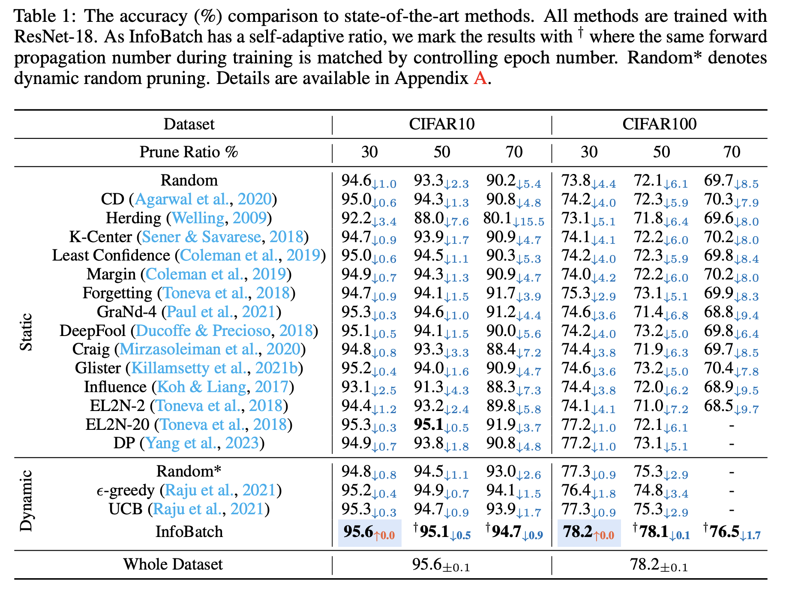

**CIFAR10, 100**에서는 동일한 pruning ratio를 사용하여 비교하였습니다. 30%의 pruning ratio를 사용했을 때 전체 데이터셋을 사용하는 것과 Accuracy 성능차이가 없는 것을 확인할 수 있습니다. **ImageNet-1K**에 대한 Accuracy 성능도 일정 pruning ratio에서는 성능이 유지되었습니다. 또한, **ImageNet-1K**를 활용한 효율성 실험에서도 pruning ratio가 0.4인 InfoBatch가 기존 방법론보다 효율적이었습니다.

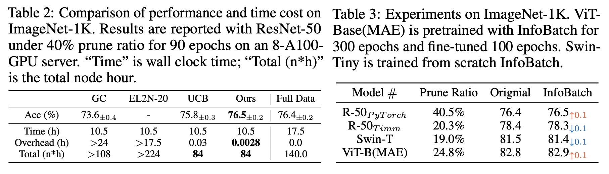

아래 그래프를 통해서 epoch수가 늘어남에 따라 전체 데이터셋을 모두 활용하는 방식에 비해 학습 시간의 훨씬 줄어드는 것을 확인할 수 있습니다. 

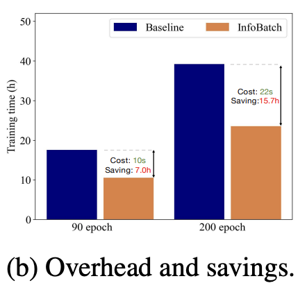

### 3.2.2 Semantic Segmentation & Image Generation

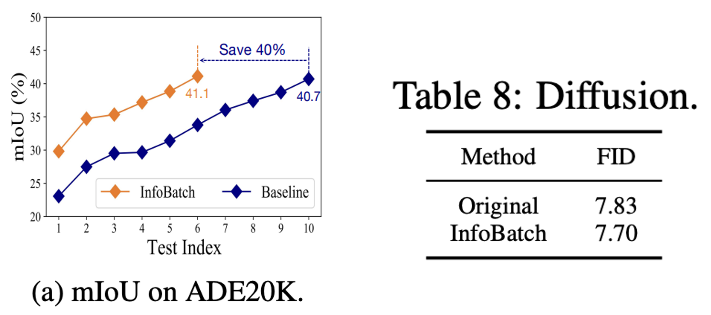

Semantic Segmentation에서도 InfoBatch를 활용하면 성능을 유지하면서도, cost를 많이 줄일 수 있습니다. Image Generation(Latent Diffusion)에서도 InfoBatch를 활용하여 FID를 유지하며, 27%의 cost를 줄였습니다. 

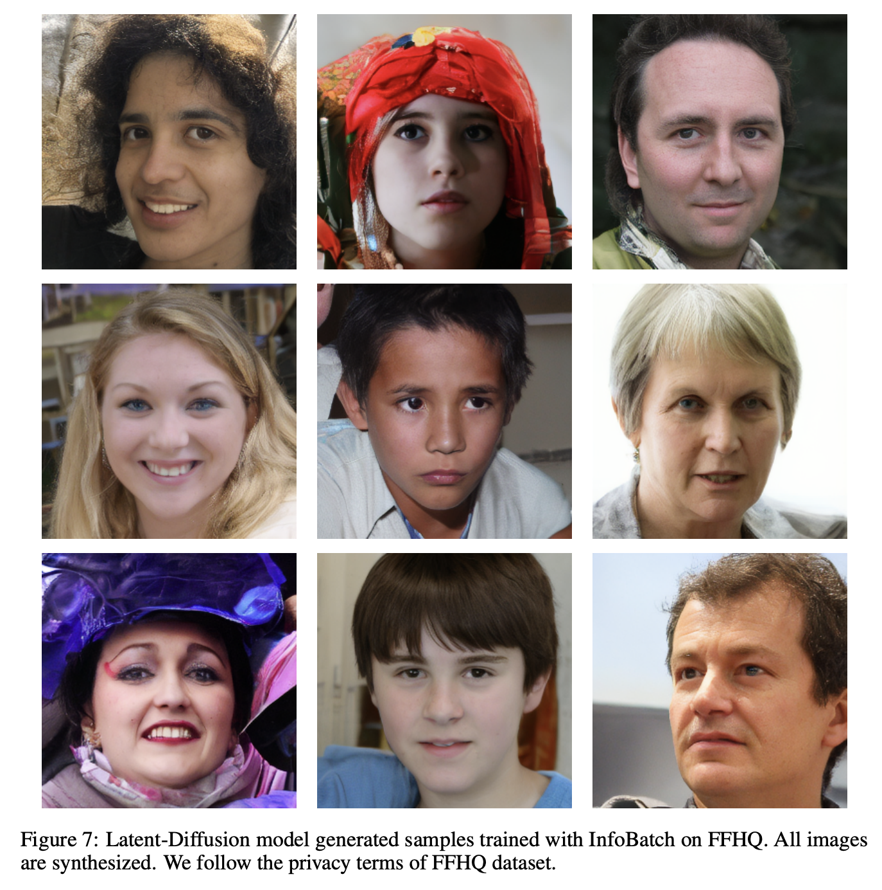

### 3.2.3 LLAMA Instruction Fine-tuning

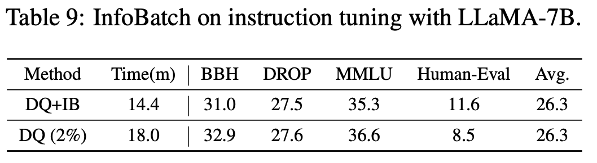

Computer vision task 이외에도 instruction 데이터셋을 활용한 LLM fine-tuning에서도 InfoBatch를 활용하면 성능을 유지하면서도 cost를 줄일 수 있습니다. Data Quantization을 적용해 instruction 데이터셋을 줄이고, 이에 InfoBatch를 적용해 성능을 유지하며, cost를 줄였습니다.

## 3.3 Ablation Study

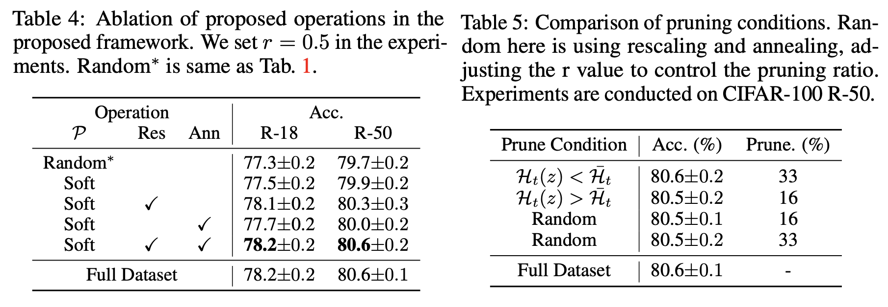

제안된 rescaling과 annealing 방법을 적용한 경우, 성능이 가장 좋았음을 확인할 수 있습니다. 
임계치에 따라 pruning을 적용하는 방식에 따라서도 제안하는 pruning 방식이 가장 성능을 잘 유지하였습니다. 

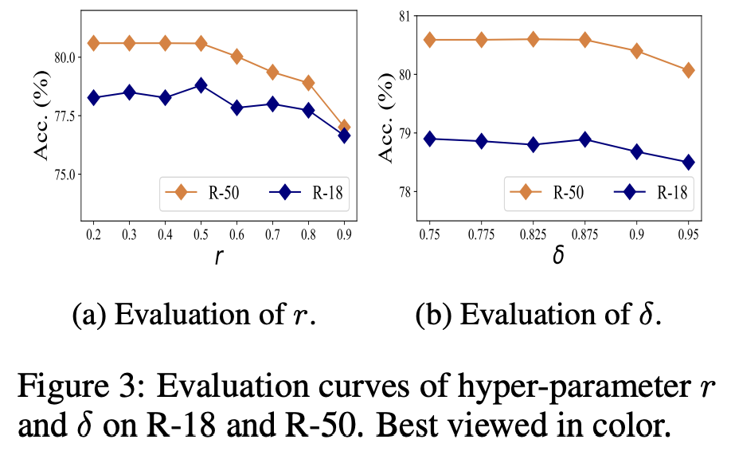

pruning 확률에 따른 성능 변화를 확인한 결과, $r \le 0.5$ 일 때 성능을 유지했으며, 더 커지면 성능이 떨어지는 것을 확인할 수 있습니다. 또한, 성능 분산을 줄이기 위해 마지막 몇 epoch에서는 annealing을 사용했는데, 
$\delta$는 학습 epoch의 분위수로 설정하였습니다. 0.75부터 실험하였으며, $\delta \le 0.875$일 때 가장 성능이 좋았습니다. 

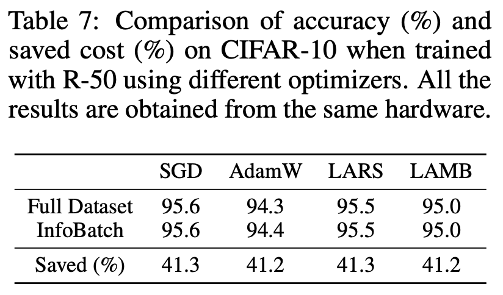

다양한 optimizer에 대해서도 비교 실험을 하였는데, InfoBatch를 사용한 것이 성능을 유지하며 cost를 41%정도 줄였습니다. 

# 4. Conclusion & Discussion
이 연구는 대용량 데이터셋에서 모델의 성능은 유지한채 학습 효율성을 늘리기 위한 Pruning 방법중 새로운 방법을 제안한 연구입니다. 새로운 Dynamic pruning 방법을 제안하며, Image classification, Semantic Segmentation, Image Generation, LLM fine-tuning 등 다양한 작업에서 성능을 유지하면서도 연산량을 크게 줄였습니다. 

이 논문은 InfoBatch가 필요한 이유와 방법론, 실험이 잘 작성된 것 같습니다. 경량화 부분에 대한 지식이 많이 없었는데, 본 논문을 통해 Static, Dynamic pruning 등 기존 방법론에 대한 이해와 기존 방법론의 한계를 InfoBatch가 어떻게 해결하였는지 잘 이해할 수 있었습니다. 또한, 방법론의 수식을 통해 더 깊이 있게 이해할 수 있었으며, 실험 결과를 통해 InfoBatch가 다양한 과제에서 어떻게 성능을 유지하면서도 연산량을 줄였는지 확인할 수 있었습니다.

개인적으로 궁금했던 점도 있었습니다. Table 2 실험의 ImageNet-1K에서 prune ratio가 0.4일 때 성능을 비교하였는데, 다른 prune ratio에 따른 성능도 비교하면 어떨지 궁금했습니다. Cifar-10, 100에서는 prune ratio가 30%일 때 가장 성능이 좋았는데, ImageNet-1k에서는 40%가 가장 좋았다면 그 차이에 대한 원인을 제공했다면 더 좋았을 것 같습니다. 또한, Semantic segmentation, Image Generation과 같은 다른 과제에 대한 구체적인 실험 내용과 결과를 보여줬다면 더 좋았을 것 같습니다. 예를 들어, Image Generation에서 LDM을 사용하였는데 구체적으로 시간이 얼마나 줄었고, 학습 과정에서 하이퍼 파라미터 등은 어떻게 설정하였는지에 대해서 알고 싶었습니다. 뿐만 아니라 다른 task에 대한 실험에서도 이전 Static, Dynamic pruning 방법론과 비교된 실험 결과를 제공했다면 조금 더 설득력 있는 연구가 되었을 것 같습니다.